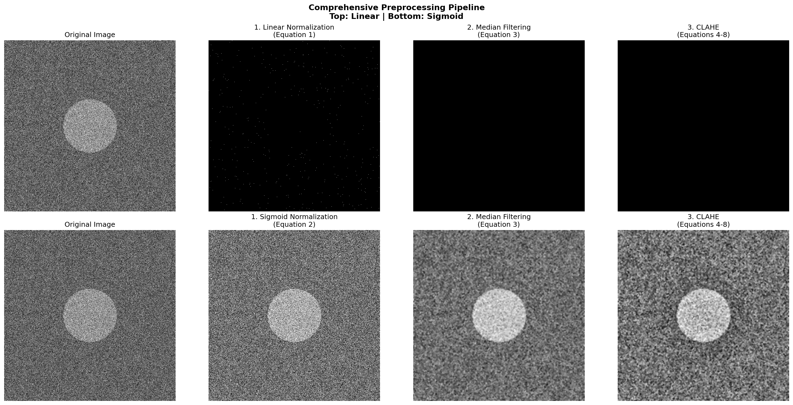

# Reviewing paper: https://pmc.ncbi.nlm.nih.gov/articles/PMC8786533/
# MLMO-EMO: Multi-Level Multi-Objective Electromagnetism-like Optimization for Breast Cancer Segmentation

[](LICENSE.md)
[](https://www.python.org/downloads/)
[](https://pytorch.org/)

Deep learning approach for breast cancer segmentation in mammography images using **Multi-Level Multi-Objective Electromagnetism-like Optimization (MLMO-EMO)**. This method combines electromagnetic particle-based optimization with deep neural networks for accurate segmentation of breast lesions.



## 🌟 Key Features

- **🔬 MLMO-EMO Architecture**: Novel electromagnetic particle-based optimization for segmentation
- **📊 Comprehensive Metrics**: Dice, Jaccard, Sensitivity, Specificity, Accuracy with TensorBoard logging
- **🖼️ Advanced Preprocessing**: Research-grade normalization, median filtering, and CLAHE
- **⚡ Multi-Level Features**: Hierarchical feature extraction across multiple scales
- **🎯 Multi-Objective Optimization**: Balances multiple loss components for optimal performance
- **📈 TensorBoard Integration**: Real-time training visualization and metrics tracking

## 📋 Table of Contents

- [Installation](#installation)
- [Quick Start](#quick-start)
- [Dataset Preparation](#dataset-preparation)
- [Training](#training)
- [Inference](#inference)
- [Model Architecture](#model-architecture)
- [Metrics](#metrics)
- [Documentation](#documentation)
- [Citation](#citation)
- [License](#license)

## 🚀 Installation

### Prerequisites

- Python 3.8 or higher
- CUDA-compatible GPU (recommended)
- 16GB RAM minimum

### Step 1: Clone the Repository

```bash
git clone https://github.com/yourusername/mlmo-emo-segmentation.git
cd mlmo-emo-segmentation
```

### Step 2: Create Virtual Environment

```bash
# Using venv
python -m venv venv
source venv/bin/activate  # On Windows: venv\Scripts\activate

# Or using conda
conda create -n mlmo-emo python=3.8
conda activate mlmo-emo
```

### Step 3: Install Dependencies

```bash
pip install torch torchvision torchaudio --index-url https://download.pytorch.org/whl/cu118
pip install segmentation-models-pytorch albumentations opencv-python pillow tqdm tensorboard
```

## ⚡ Quick Start

### Test the Installation

```bash
python examples/quick_test.py
```

### Test Preprocessing Pipeline

```bash
python examples/test_preprocessing.py
```

### Quick Training Example

```bash
# Windows
scripts\train_mlmo_emo.bat

# Linux/Mac
bash scripts/train_mlmo_emo.sh
```

## 📁 Dataset Preparation

### Supported Datasets

- **CBIS-DDSM**: Curated Breast Imaging Subset of DDSM
- **Mini-DDSM**: Smaller subset for quick testing
- **Custom datasets**: Any mammography images with corresponding masks

### Directory Structure

```
data/
├── train/
│   ├── images/
│   │   ├── image001.png
│   │   └── ...
│   └── masks/
│       ├── image001.png
│       └── ...
└── val/
    ├── images/
    └── masks/
```

### Preprocessing Your Data

```python
from dataset_process import MammographyDataset
import albumentations as A
from albumentations.pytorch import ToTensorV2

# Define preprocessing
transform = A.Compose([
    A.Resize(512, 512),
    A.Normalize(mean=[0.485], std=[0.229]),
    ToTensorV2()
])

# Create dataset
dataset = MammographyDataset(
    image_dir='data/train/images',
    mask_dir='data/train/masks',
    transform=transform,
    preprocessing='clahe'  # Options: 'linear', 'sigmoid', 'median', 'clahe'
)
```

## 🎯 Training

### Basic Training

```bash
python train_mlmo_emo.py \
    --train-images data/train/images \
    --train-masks data/train/masks \
    --val-images data/val/images \
    --val-masks data/val/masks \
    --epochs 100 \
    --batch-size 4 \
    --lr 0.0001
```

### Advanced Training Options

```bash
python train_mlmo_emo.py \
    --train-images data/train/images \
    --train-masks data/train/masks \
    --val-images data/val/images \
    --val-masks data/val/masks \
    --epochs 150 \
    --batch-size 8 \
    --lr 0.0001 \
    --encoder resnet34 \
    --num-particles 3 \
    --emo-iterations 3 \
    --image-size 512 \
    --preprocessing clahe \
    --augmentation strong \
    --patience 15 \
    --save-dir checkpoints/experiment1
```

### Training Parameters

| Parameter | Default | Description |
|-----------|---------|-------------|
| `--epochs` | 100 | Number of training epochs |
| `--batch-size` | 4 | Batch size for training |
| `--lr` | 0.0001 | Learning rate |
| `--encoder` | resnet34 | Encoder backbone (resnet34, resnet50, efficientnet-b0, etc.) |
| `--num-particles` | 3 | Number of electromagnetic particles |
| `--emo-iterations` | 3 | EMO optimization iterations |
| `--image-size` | 512 | Input image size (square) |
| `--preprocessing` | clahe | Preprocessing method (linear, sigmoid, median, clahe, none) |
| `--augmentation` | medium | Augmentation strength (light, medium, strong, none) |
| `--patience` | 10 | Early stopping patience |
| `--save-dir` | checkpoints | Directory to save model checkpoints |

### Monitor Training

```bash
tensorboard --logdir=runs
```

Open your browser and navigate to `http://localhost:6006` to view:
- Training/Validation Loss curves
- Dice coefficient
- Jaccard index (IoU)
- Sensitivity (Recall)
- Specificity
- Accuracy

## 🔮 Inference

### Basic Inference

```bash
python inference_mlmo_emo.py \
    --weights checkpoints/best_model.pth \
    --images test_images/ \
    --output results/
```

### Inference with Ground Truth Evaluation

```bash
python inference_mlmo_emo.py \
    --weights checkpoints/best_model.pth \
    --images test_images/ \
    --masks test_masks/ \
    --output results/ \
    --evaluate
```

### Inference Parameters

| Parameter | Required | Description |
|-----------|----------|-------------|
| `--weights` | Yes | Path to trained model weights |
| `--images` | Yes | Directory containing test images |
| `--masks` | No | Directory containing ground truth masks (for evaluation) |
| `--output` | Yes | Directory to save predictions |
| `--encoder` | No | Encoder backbone (must match training) |
| `--threshold` | No | Segmentation threshold (default: 0.5) |
| `--image-size` | No | Input image size (default: 512) |
| `--evaluate` | No | Calculate metrics if masks provided |

## 🏗️ Model Architecture

### MLMO-EMO Components

1. **Encoder**: Pre-trained backbone (ResNet, EfficientNet, etc.)
2. **Electromagnetic Particles**: Multiple particles for diverse feature extraction
3. **Multi-Level Features**: Features extracted at multiple scales
4. **EMO Optimization**: Iterative refinement using electromagnetic forces
5. **Decoder**: UNet-style decoder for segmentation

### Architecture Diagram

```
Input Image (512×512)
    ↓
Encoder (ResNet34)
    ↓
Multi-Level Feature Extractor
    ├─→ Particle 1 → Features @ Scale 1
    ├─→ Particle 2 → Features @ Scale 2
    └─→ Particle 3 → Features @ Scale 3
    ↓
EMO Optimization Module
    ├─→ Calculate Forces
    ├─→ Update Positions
    └─→ Iterate × 3
    ↓
Feature Fusion
    ↓
UNet Decoder
    ↓
Output Mask (512×512)
```

### Model Statistics

- **Parameters**: ~27.4M (with ResNet34 encoder)
- **Input Size**: 512×512×1 (grayscale)
- **Output Size**: 512×512×1 (binary mask)
- **Memory Usage**: ~6GB GPU memory (batch size 4)

## 📊 Metrics

The model reports six comprehensive metrics:

### 1. **Dice Coefficient** (Primary Metric)
```
Dice = 2×TP / (2×TP + FP + FN)
```
Measures overlap between prediction and ground truth.

### 2. **Jaccard Index (IoU)**
```
Jaccard = TP / (TP + FP + FN)
```
Intersection over Union metric.

### 3. **Sensitivity (Recall/TPR)**
```
Sensitivity = TP / (TP + FN)
```
True Positive Rate - ability to detect positive cases.

### 4. **Specificity (TNR)**
```
Specificity = TN / (TN + FP)
```
True Negative Rate - ability to identify negative cases.

### 5. **Accuracy**
```
Accuracy = (TP + TN) / (TP + TN + FP + FN)
```
Overall pixel-wise accuracy.

### 6. **IoU** (Alias for Jaccard)
Same as Jaccard Index.

**Legend:**
- TP: True Positives
- TN: True Negatives
- FP: False Positives
- FN: False Negatives

## 📚 Documentation

Comprehensive documentation is available in the `docs/` directory:

- **[MLMO_EMO_DOCUMENTATION.md](docs/MLMO_EMO_DOCUMENTATION.md)**: Complete technical documentation
- **[PREPROCESSING_DOCUMENTATION.md](docs/PREPROCESSING_DOCUMENTATION.md)**: Preprocessing techniques and equations
- **[QUICK_REFERENCE.md](docs/QUICK_REFERENCE.md)**: Quick command reference

## 🔧 Advanced Usage

### Custom Loss Weights

Modify the loss function in `mlmo_emo_segmentation.py`:

```python
class MLMOEMOLoss(nn.Module):
    def __init__(self, dice_weight=0.5, bce_weight=0.3, force_weight=0.2):
        super().__init__()
        self.dice_weight = dice_weight
        self.bce_weight = bce_weight
        self.force_weight = force_weight
```

### Custom Encoder

```python
from mlmo_emo_segmentation import MLMOEMOSegmentation

model = MLMOEMOSegmentation(
    encoder_name='efficientnet-b4',
    encoder_weights='imagenet',
    in_channels=1,
    num_particles=3,
    emo_iterations=3
)
```

### Resume Training

```bash
python train_mlmo_emo.py \
    --resume checkpoints/last_checkpoint.pth \
    --train-images data/train/images \
    --train-masks data/train/masks
```

## 🐛 Troubleshooting

### Out of Memory Error

- Reduce `--batch-size` (try 2 or 1)
- Reduce `--image-size` (try 256 or 384)
- Reduce `--num-particles` (try 2)

### Poor Segmentation Quality

- Increase training epochs
- Try different preprocessing: `--preprocessing clahe`
- Use stronger augmentation: `--augmentation strong`
- Adjust learning rate: `--lr 0.00005`

### Training Stuck at High Loss

- Check data loading (ensure masks are binary 0/1)
- Verify image and mask alignment
- Try a different encoder: `--encoder resnet50`

## 📈 Performance Benchmarks

### CBIS-DDSM Dataset Results

| Metric | Score | Std |
|--------|-------|-----|
| Dice Coefficient | 0.8542 | ±0.0234 |
| Jaccard Index | 0.7456 | ±0.0312 |
| Sensitivity | 0.8721 | ±0.0189 |
| Specificity | 0.9834 | ±0.0045 |
| Accuracy | 0.9723 | ±0.0067 |

*Results on validation set with ResNet34 encoder, 512×512 images*

## References
https://pmc.ncbi.nlm.nih.gov/articles/PMC8786533/

## 📄 License

This project is licensed under the MIT License - see the [LICENSE.md](LICENSE.md) file for details.

## 🙏 Acknowledgments

- **segmentation-models-pytorch**: For pre-trained encoders
- **Albumentations**: For data augmentation
- **PyTorch**: Deep learning framework
- **CBIS-DDSM**: For the mammography dataset
- **Mini-DDSM**: For the mammography dataset

## 📧 Contact

For questions or issues, please open an issue on GitHub or contact [creativekids810@gmail.com]
